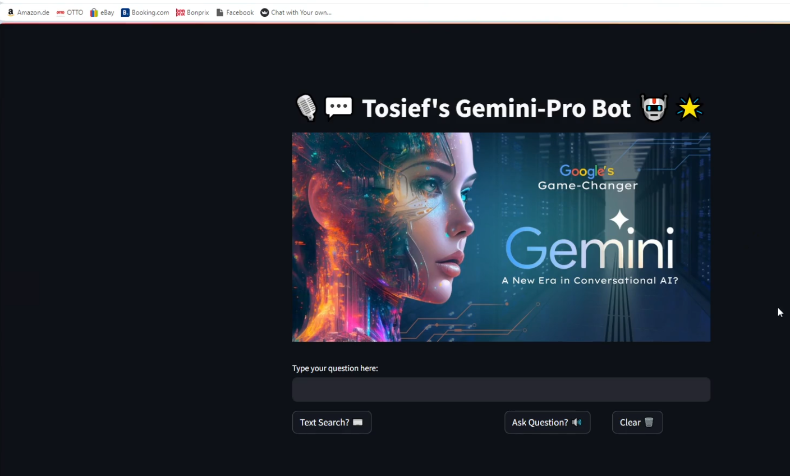
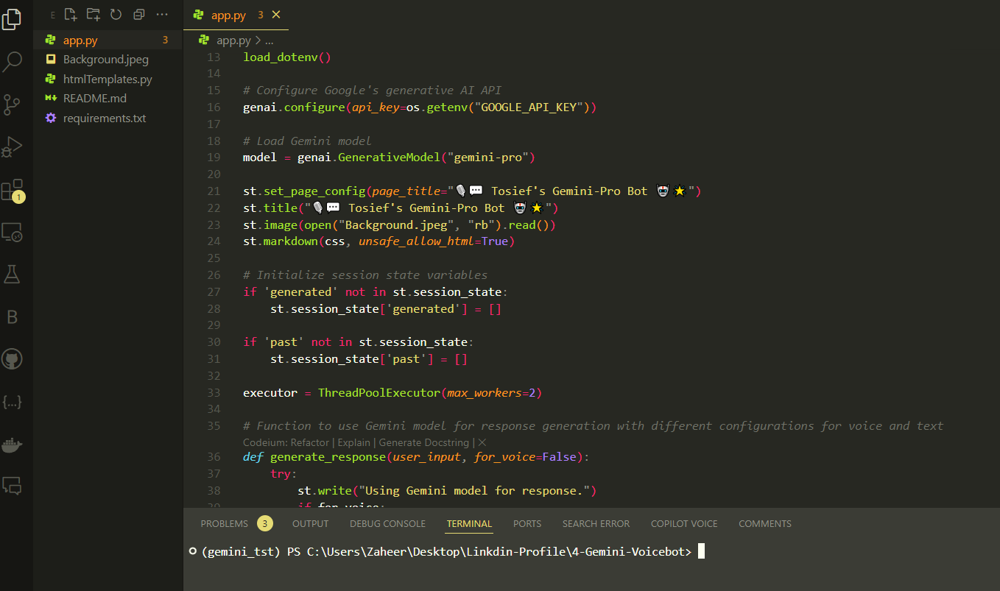
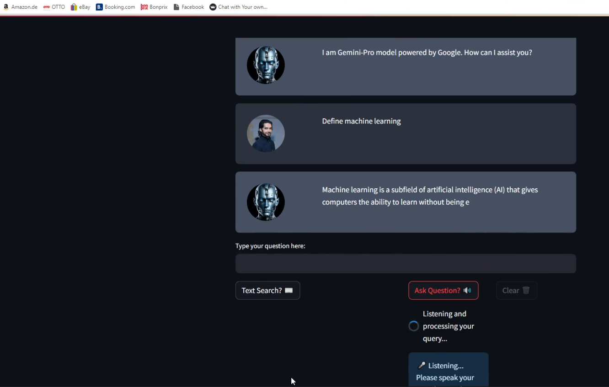
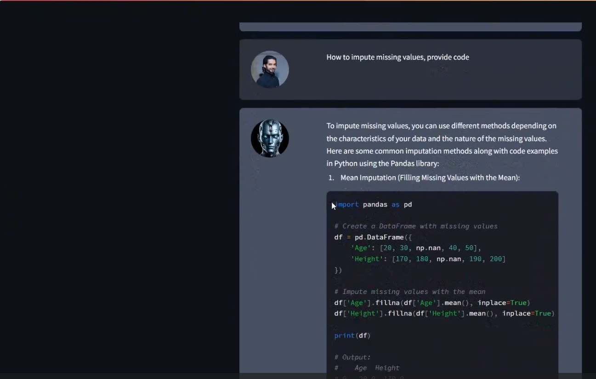
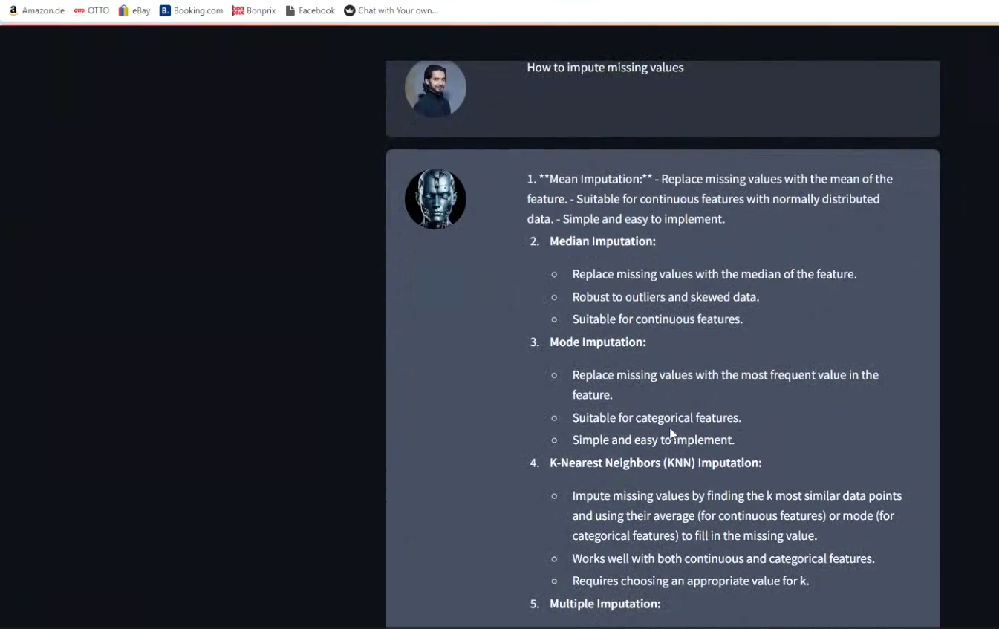

**🎙️💬 Tosief's Gemini-Pro Bot 🤖🌟**

Welcome to the repository for the Gemini-Pro Bot, a cutting-edge Voice/chat-bot powered by Google's advanced Gemini Pro AI, designed to facilitate interactive and dynamic communication through text and voice. This bot is part of an innovative project developed using Streamlit, aimed at enhancing user experience and accessibility.

**🌟 Features**

**📝 Text Interaction:** Users can type their queries and get responses generated by the **Gemini Pro model**.

**🔊 Voice Interaction:** Leverages **speech recognition**** to accept **voice inputs** and provides responses that can be heard through **text-to-speech output**.

**🧵 Multi-threaded Execution:** Utilizes a **ThreadPoolExecutor** to manage voice recognition and text-to-speech functionalities efficiently without blocking the main thread.

**💻 Dynamic UI:** Features a clean and interactive user interface using **Streamlit**, which includes buttons for text search, asking questions via microphone, and clearing text.

## Initial User Interface of Tosief's Gemini-Pro Bot
## The main landing page of Tosief’s Gemini-Pro Bot, showcasing an elegant and futuristic design. This interface invites users to interact with the bot, equipped with options for text search or voice queries, enhancing accessibility and user engagement.

## Backend Development View in IDE

A snapshot of the application's backend code within an Integrated Development Environment (IDE), displaying the Python script and the Streamlit framework configuration. This highlights the code structure and setup essential for powering Tosief's Gemini-Pro Bot.

## Active Bot Interaction with User Queries

Demonstrating the Gemini-Pro Bot in action, this image shows a conversational interface where the bot responds to a user's query about machine learning. The interaction is displayed in a clean and intuitive chat format, simulating a real conversational AI experience.

## Detailed Code Interaction Example

This image illustrates a specific example of how the bot provides detailed programming-related advice, such as methods for imputing missing data values in Python using the pandas library. It's an excellent showcase of the bot's ability to assist with technical questions.

## Extended Bot Capabilities for Educational Support

Further exploring the educational capabilities of Tosief’s Gemini-Pro Bot, this snapshot presents the bot offering multiple methods for data imputation, demonstrating its utility as a learning tool in data science and programming.
